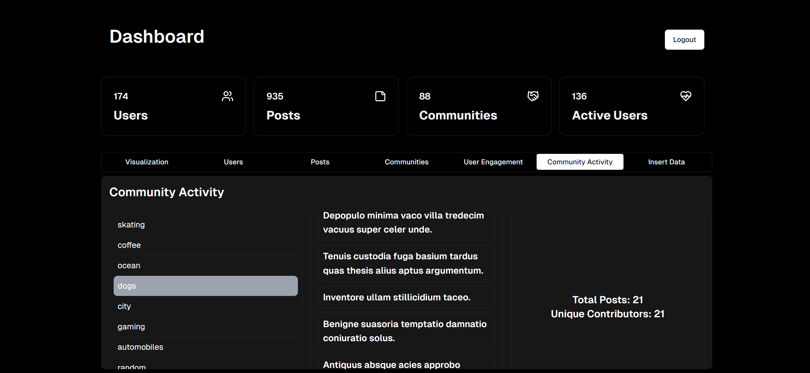

# INFS 740 PROJECT

Name: Sanjana Vatsavai

G-Number: G01371785

Email: svatsava@gmu.edu

### Project Installation

1. [Install Node (v20.11.1)](https://nodejs.org/en/download)
2. Install Dependencies - `npm install`
3. Create a ```.env.local``` file and add the following environment variables:

    ```
    MONGODB_URI = MongoDB URI String
    SESSION_SECRET = Create a random session secret
    NODE_ENV = development
    ```
4. Run the code in **http://localhost:3000/** - `npm run dev`

### Tech Stack

1. Frontend: React
2. Backend: Next.js 14
3. Database: MongoDB
4. Development Dependencies: Tailwind CSS, Radix UI, Shad-cn, TypeScript

### Collections

1. Users
2. Posts
3. Communities

### Basic Queries (CRUD Operations)

1. Users:

    - **View**: Retrieve and display a list of all users (in admin page), or a specific user's details (when user logs in).

    - **Insert**: Add a new user to the collection, including details like name, email, username, phone number, and password. Users can be added in the admin page or users can sign up with their details.

    - **Update**: Modify details of an existing user, such as updating their email address or the communities they're part of.

    - **Delete**: Remove a user from the database.

2. Posts:

    - **View**: Display posts, with options to filter by user or community.

    - **Insert**: Allow users to create a new post, including title, content, associated community, and image.

    - **Update**: Enable editing of post content or its associated community.

    - **Delete**: Delete the user's post from the database

3. Communities:

    - **View**: Show a list of all communities or detailed view of a selected community, including a list of members and posts.

    - **Insert**: Add a new community with details like name, description, and community image.

    - **Update**: Update community details like name, bio, and community image.

    - **Delete**: Remove a community from the database.

### Search Queries

1.  User Engagement Overview: Displaying User Posts and Community Associations

    In the admin section, under the user engagement tab, administrators can browse a comprehensive list of all website users. Upon selecting a user, the interface displays all posts created by that user. Furthermore, it reveals detailed information about the communities related to these posts.

    This query integrates the posts, users, and communities collections effectively. Initially, all users are listed in a table format. When an admin clicks on a specific user, the system retrieves and displays all posts made by that user in a central table. The communities associated with each post are compiled into a set, enabling the system to gather and display details about all communities the user has interacted with. These community details are then shown in a concluding table, providing a holistic view of user engagement across different community spaces.

    <p align="center">
    
    </p>

2. Overview of Community Engagement Analytics on the Admin Dashboard

    In the admin page, under the community activity tab, the admin can view a list of all communities registered on the website. By selecting a specific community, the admin can see all the posts associated with that community displayed. Alongside the posts, a statistical panel provides insights into the total number of posts made within the selected community and the number of unique contributors.

    This search query leverages the communities, posts, and users collections. Initially, all communities are listed for selection. Upon selecting a community, the system fetches and displays all posts from that community. Concurrently, it calculates the total number of posts and identifies unique users who have contributed, effectively summarizing the engagement within the community. This information is organized into a visually structured layout with separate sections for community selection, post details, and statistical data, enhancing the admin's ability to monitor and analyze community interactions.

    <p align="center">
    
    </p>

### Visualization

There are three visualizations for three communities. Each visualization displays the number of entries made to each collection in the past 30 days.

For the Users collection, the visualization shows the number of users that signed up on the website in the last 30 days:
<p align="center">

</p>

For the Posts collection, the visualization shows the total number of posts made in the last 30 days:
<p align="center">

</p>

For the Communities collection, the visualization shows the number of communities created in the last 30 days:
<p align="center">

</p>

### UI Screenshots

<p align="center">

</p>
<p align="center">

</p>
<p align="center">

</p>
<p align="center">

</p>
<p align="center">

</p>
<p align="center">

</p>